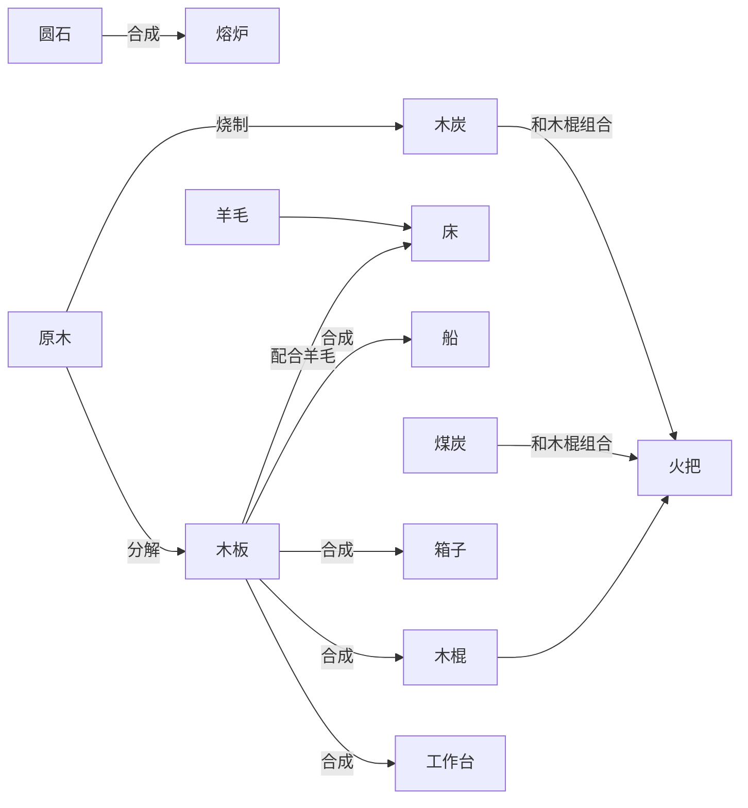
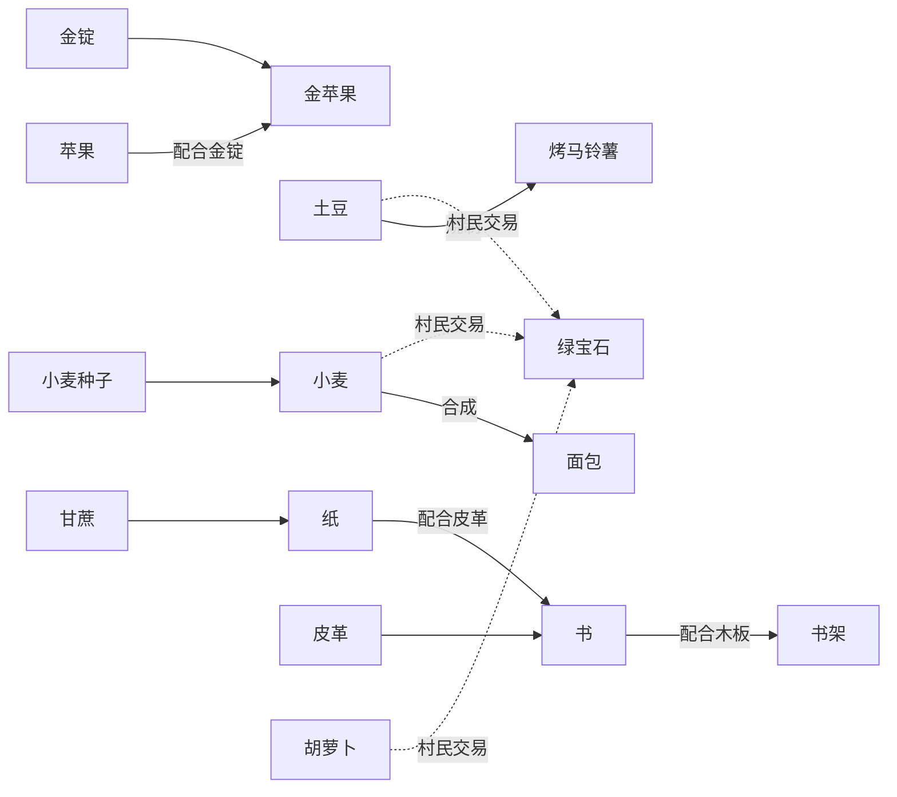
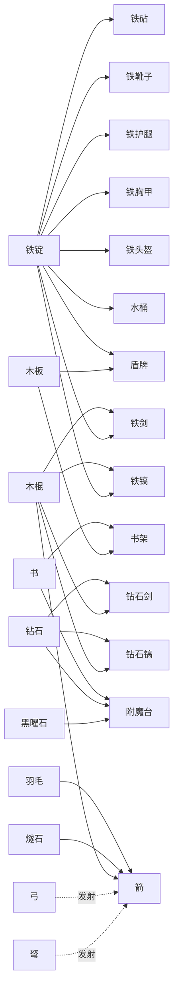
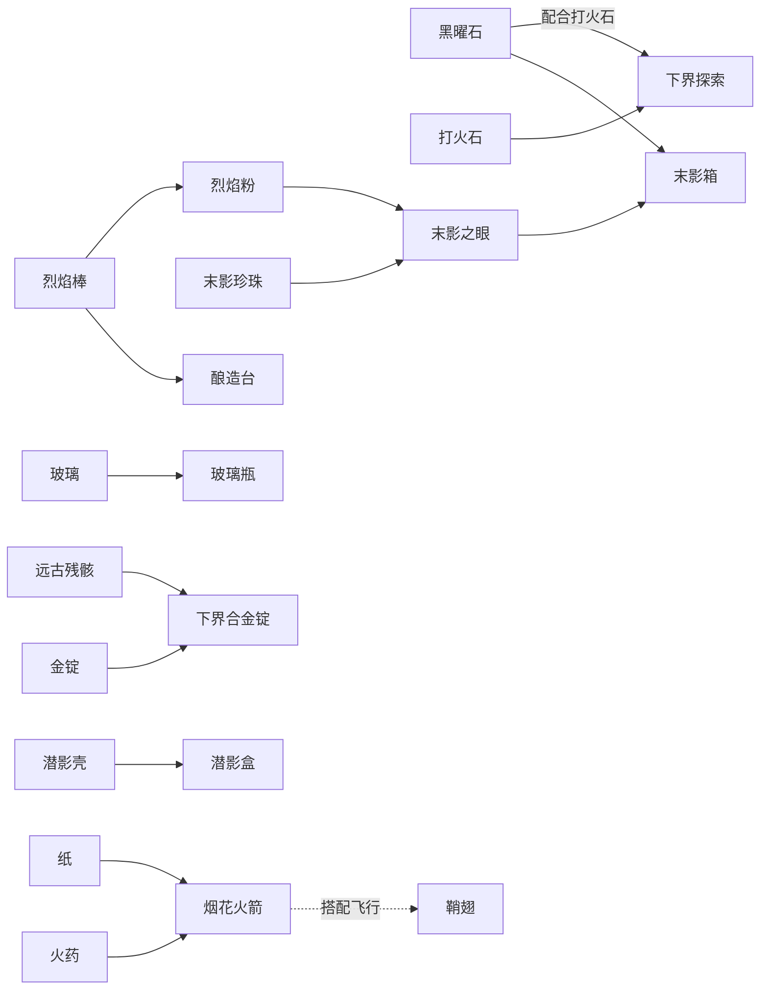
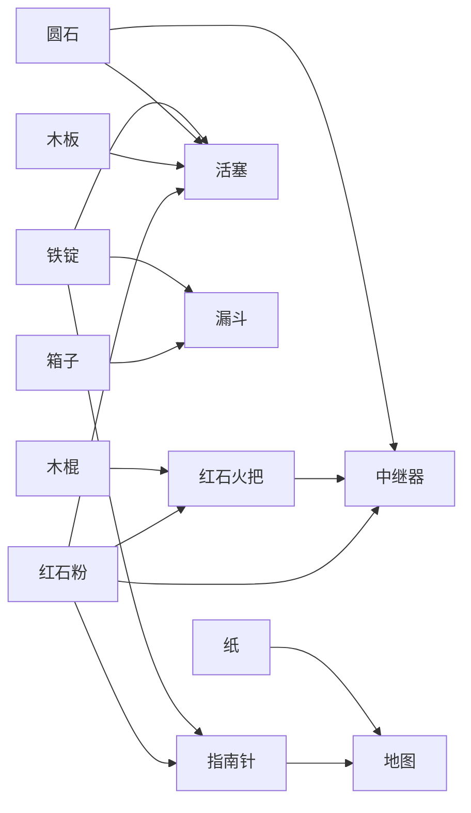

# 物品关系图

这个页面把物品大全里的常用关系用 Mermaid 图拆成几张主题图。相比把全部物品硬塞进一张超大图，这种写法更适合在 Markdown 预览里阅读和维护。

如果你使用的是支持 Mermaid 的 Markdown 预览器，这些代码块会直接渲染成图。

## 1. 开局基础链

## 2. 食物与交易链

## 3. 装备与附魔链

## 4. 下界与末地推进链

## 5. 红石、工具与功能方块链

## 怎么用这页

- 想快速补脑物品链路时，先看开局基础链和装备与附魔链。
- 准备进下界、找要塞、打龙时，重点看下界与末地推进链。
- 做基地和自动化时，再看红石、工具与功能方块链。

---

[返回目录](00-目录.md)
